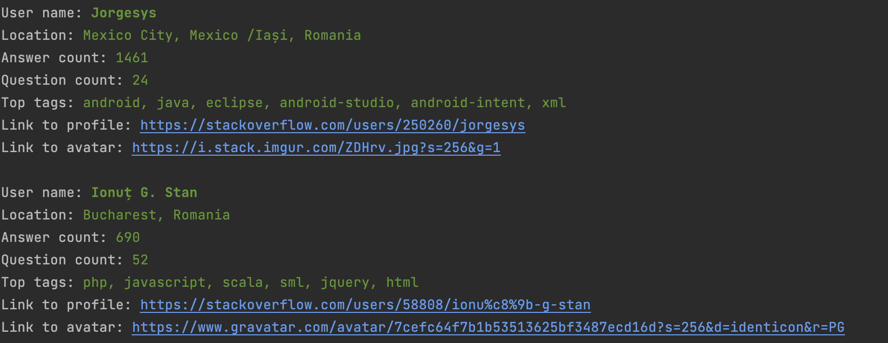

# Stack-users

## 📃 Description
This is a simple Java program that displays Stackoverflow users on the screen according to the following criteria:

* Are located in Romania or Moldova
* Have a reputation of min 223 points
* Answered min 1 question
* Have the tags: "java", ".net", "docker" or "C#"

Reader uses [Stack Exchange API](https://api.stackexchange.com/docs) to get users and tags.
Since the API has limitations, the program has access to only 2,500 users.

After completing the requests and processing the received data,
the terminal will display information about all users found according to the criteria:
user name, location, answer count, question count, top tags, links to profile and avatar

## 🧑‍💻 Technologies
| Technology | Version |
|:-----------|:--------|
| JDK        | 17      |
| Gradle     | 7.6     |
| Lombok     | 1.18.22 |
| Retrofit   | 2.9.0   |
| Gson       | 2.9.0   |

## 📎 How to start the program
1. Clone the project from GitHub
2. Open folder in terminal and run `./gradlew clean build`
3. Change folder to `build/libs`
4. Run `java -jar file-name.jar` where `file-name` is name of executed file

To start the program immediately, you can download [build](https://github.com/pavlogook/stackoverflow-users-reader/releases/tag/build) and execute the last command

## ✨ Screenshot

